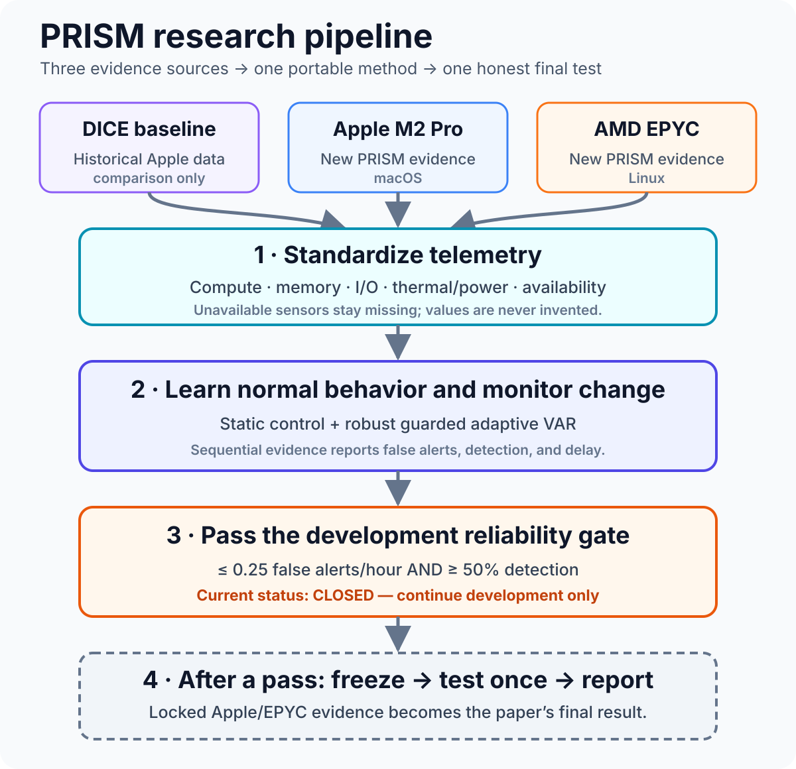

# PRISM

**PRISM: Platform-Robust In-Field Sequential Monitoring for Silicon Lifecycle Management**

PRISM is the proposed journal extension of the DICE host-side monitoring study. It asks a focused question:

> Can a behavioral micro-twin provide reliable, statistically calibrated in-field monitoring across heterogeneous host platforms without requiring identical telemetry channels?

The repository is intentionally private-ready while the work is unpublished.
It contains the research plan, experiment contract, paper outline, and one
canonical, executable notebook for the complete experiment. Raw telemetry may
be imported locally but is not tracked in Git.

## Journal Thesis

PRISM maps platform-specific host telemetry into a common functional representation, fits a benign-only behavioral micro-twin per platform, and converts temporally dependent residual blocks into sequential evidence. Its evaluation emphasizes:

1. cross-platform calibration and transfer between Apple M2 Pro/macOS and AMD EPYC/Linux;
2. false alerts per monitored hour and time-to-detect under repeated, temporally dependent testing;
3. calibration effort on a newly observed platform;
4. robustness to benign drift, controlled crashes, and telemetry interruption;
5. optional host-side telemetry escalation when richer evidence is needed.

The proposed primary venue is **IEEE Transactions on Reliability**. The paper should be written as a reliability-monitoring contribution, not as a new conformal-inference theory paper.

## PRISM Research Flow



The historical DICE data provides a baseline; the new Apple and AMD runs test whether the same monitoring method remains reliable across different platforms and sensor capabilities.

## Relationship to Existing Projects

- **DICE (ITC):** conference baseline—host-side behavioral micro-twin, residual block scoring, split-conformal thresholds, and fixed persistence on Apple M2 Pro.
- **PRISM:** journal extension—cross-platform host telemetry semantics, repeated long-horizon evaluation, and sequential reliability evidence.
- **CITADEL:** separate TCAD direction—hardware-counter analytics, causal/stable feature selection, hardware-aware design-space exploration, fixed-point/RTL/FPGA validation, and lifecycle monitor synthesis.

PRISM must not absorb CITADEL's hardware novelty. In particular, PRISM does not claim RTL synthesis, on-chip feature ranking, fixed-point cost, or FPGA validation.

## Critical-Path Scope

The August 30 submission path has three required contributions:

1. **Platform-semantic telemetry contract**
   - Functional groups: compute, memory, I/O, thermal/power, accelerator, and availability.
   - Platform adapters preserve missingness and provenance; unavailable counters are never filled with arbitrary zeros.
2. **Dependence-aware sequential monitoring**
   - Compare original DICE fixed persistence with CUSUM/EWMA and an established conformal test-martingale or e-process.
   - Report operational reliability metrics, especially false alerts per monitored hour.
3. **Repeated dual-platform study**
   - Independent runs, long benign traces, workload holdout, platform transfer, controlled crashes, and telemetry interruptions.

Safe online micro-twin updates and adaptive telemetry escalation are secondary contributions. They enter the paper only if their result gates pass by August 20.

## Repository Map

- `docs/research-plan.md`: schedule, owners, gates, and fallback rules.
- `docs/data-collection.md`: DICE reuse policy and the new PRISM collection protocol.
- `docs/data-collection-roadmap.md`: ordered Apple/Linux operator handbook from
  environment freeze through locked-test completion.
- `docs/drift-aware-analysis.md`: portable, guarded robust-normalization and
  adaptive-VAR execution sequence, G3 rule, and current development checkpoint.
- `docs/extension-collection-contract.md`: executable acceptance mapping from the extension memo to required evidence.
- `docs/apple-collection.md`: notebook-only Apple M2 setup, smoke test, and production workflow.
- `docs/linux-asu-collection.md`: detailed ASU EPYC preparation, collection, validation, and transfer.
- `docs/novelty-boundary.md`: claim matrix and separation from DICE/CITADEL.
- `configs/experiment-matrix.toml`: machine-readable experiment design.
- `data/README.md`: immutable data layout and provenance rules.
- `paper/outline.md`: journal narrative and required tables/figures.
- `notebooks/PRISM_Complete_Experiment.ipynb`: canonical source for collection,
  validation, tests, DICE import, dual-platform semantic preprocessing,
  ridge/VAR micro-twins, sequential method selection, transfer calibration,
  and the guarded method freeze.

## Portable Quick Start

Clone PRISM into any writable directory on the Mac or Linux server. If the
repository is already present, start at `cd PRISM`.

```bash
git clone https://github.com/ping830616/PRISM.git
cd PRISM
python3 -m venv .venv
source .venv/bin/activate
python3 -m pip install -e ".[notebook]"

# Portable paths
export PRISM_REPO_ROOT="$PWD"
export PRISM_DATA_ROOT="${PRISM_DATA_ROOT:-$PWD/data}"

# Reproducible PRISM protocol
export PYTHONHASHSEED=0
export PRISM_NUM_THREADS=1
export PRISM_STRESS_MB=128
export MPLCONFIGDIR="$PWD/.mplconfig"
export OMP_NUM_THREADS="$PRISM_NUM_THREADS"
export OPENBLAS_NUM_THREADS="$PRISM_NUM_THREADS"
export MKL_NUM_THREADS="$PRISM_NUM_THREADS"
export VECLIB_MAXIMUM_THREADS="$PRISM_NUM_THREADS"
export NUMEXPR_NUM_THREADS="$PRISM_NUM_THREADS"
export BLIS_NUM_THREADS="$PRISM_NUM_THREADS"
mkdir -p "$MPLCONFIGDIR" "$PRISM_DATA_ROOT"

# Open the one canonical experiment notebook
python -m jupyter lab notebooks/PRISM_Complete_Experiment.ipynb
```

The notebook is portable across macOS and Linux and always uses the active
Jupyter kernel's Python executable. It discovers the checkout automatically,
so the repository does not need a particular folder name or home directory.
To keep large telemetry on a separate local or server volume, add
`PRISM_DATA_ROOT` **before** starting Jupyter:

```bash
export PRISM_DATA_ROOT="/absolute/path/to/prism-data"  # optional
mkdir -p "$PRISM_DATA_ROOT"
python -m jupyter lab \
  "$PRISM_REPO_ROOT/notebooks/PRISM_Complete_Experiment.ipynb"
```

`PRISM_DATA_ROOT` defaults to `<repository>/data`. The setup cells link the
disposable runtime to that selected data location, while collection and
analysis continue to use the same notebook controls. Python 3.10 or newer is
required. `PRISM_NUM_THREADS=1` and `PRISM_STRESS_MB=128` are recorded workload
settings and must stay fixed across Apple and Linux collection. The remaining
exports make hashing, numerical-library threading, and figure configuration
reproducible. The automatic integrity section rejects embedded Mac/ASU paths
and checks that the runtime, repository, and selected data root are writable
and connected correctly.

## Run PRISM: eight simple steps

Use the switches in the named notebook sections; do not run files from
`.prism_runtime/` directly.

| Step | What the researcher does | What PRISM produces |
| ---: | --- | --- |
| 1 | Open the notebook and choose **Run All Cells** with every collection/analysis switch left `False` | A safe environment, portability, preflight, and embedded-test check; no experiment starts |
| 2 | On each machine, run Section 7, then set `RUN_SMOKE_PAIR=True` in Section 8 | A 30-second normal/anomalous smoke pair and a readiness decision for Apple or Linux |
| 3 | With the machine authorized and idle, use Sections 10–12 to collect all calibration/development rows | Validated raw telemetry, events, platform/channel metadata, checksums, progress, and quality reports |
| 4 | Put both platforms under one `PRISM_DATA_ROOT`; set `RUN_PREFREEZE_AUDIT=True` in Section 14 and `RUN_PREPARE_ANALYSIS=True` once in Section 15 | A 160-run pre-freeze inventory, immutable dataset fingerprint, and five-second semantic-block cache |
| 5 | Run Section 17 and Section 17A for the static and guarded baselines; then set `RUN_ROBUST_NORMALIZATION_G3=True` in Section 17B.2 | Baseline ablations plus the authoritative robust residual-fusion development selection |
| 6 | Check Gate G3: pooled false alerts/hour must be ≤0.25 and pooled development detection must be ≥50% | The current development selection passes at 0.134 false alerts/hour and 51.7% detection; locked-test rows remain closed |
| 7 | Set `RUN_TRANSFER_ANALYSIS=True` in Section 18 and review both transfer directions before advisor review | A 0/1/2/4/8/12-minute destination-calibration curve; transfer weakness must be reported and reviewed before freeze |
| 8 | Only after G3, transfer review, advisor approval, and Section 19 method freeze, collect the 46 locked rows per platform exactly once | Final held-out evidence for the journal paper; it must never be used to retune the method |

### Results supplied to the paper

| Paper evidence | Notebook artifact or metric | Current status |
| --- | --- | --- |
| Dataset and quality table | Run counts, benign hours, cadence, channel coverage, failures, and checksum-backed provenance | Pre-freeze Apple/EPYC evidence available |
| Cross-platform telemetry table | Shared semantic groups plus Apple- and Linux-specific sensor availability | Available from smoke and quality reports |
| Monitoring comparison | Static VAR versus robust guarded adaptive VAR, persistence, EWMA, CUSUM, and conformal/e-process candidates | Development CSV/JSON generated |
| Reliability results | False alerts per benign hour, anomaly-run detection, median time-to-detect, and telemetry-interruption identification | Pooled development G3 passes; this is not a locked-test claim |
| Adaptation ablation | Accepted/rejected updates, fault freezes, promotions, and rollbacks | Guarded update audit generated |
| Platform-transfer table | Destination-platform calibration amount versus detection/reliability behavior | Development-only output generated; strong directional asymmetry requires review |
| Final headline table and figures | One-time locked-test performance with uncertainty and limitations | Not generated until G3 passes and the method is frozen |

Generated development files are stored under
`$PRISM_DATA_ROOT/processed/prism-analysis-v1/`. The static and guarded controls
remain useful ablations, but both fail G3. The selected robust residual-fusion
candidate passes the pooled development gate at 0.134 false alerts/hour and
51.7% detection. Platform-specific and directional-transfer results are less
uniform, so method freeze still requires review. The README intentionally does
not present a final locked-test claim.

### Main files to expect

- `$PRISM_DATA_ROOT/raw/<platform>/<date>/<run_id>/`: immutable telemetry,
  events, platform/channel descriptions, validation, and checksums.
- `$PRISM_DATA_ROOT/processed/smoke-gate/<commit>/comparison.json`: matched
  Apple/Linux smoke comparison.
- `$PRISM_DATA_ROOT/processed/prism-analysis-v1/development-method-selection.csv`:
  static development candidates.
- `$PRISM_DATA_ROOT/processed/prism-analysis-v1/development-guarded-method-selection.csv`:
  robust guarded adaptive-VAR candidates and G3 evidence.
- `$PRISM_DATA_ROOT/processed/prism-analysis-v1/development-robust-normalization-selection.json`:
  authoritative pooled development selection and G3 status.
- `$PRISM_DATA_ROOT/processed/prism-analysis-v1/development-transfer-calibration.csv`:
  cross-platform calibration results after Section 18.
- `paper/method-freeze.json`: frozen method and notebook fingerprint, created
  only after every development gate passes.

This follows the same portable, notebook-first pattern as
[DICE](https://github.com/ping830616/DICE), but PRISM adds dual-platform data
collection, drift-aware monitoring, and a mandatory locked-test boundary.

The notebook is the only tracked Python source. **Run All Cells is safe by
default**: it rebuilds `.prism_runtime/` and runs checks without collecting data
or opening locked tests. The DICE baseline import is optional and never counts
as new PRISM replication. Detailed Apple, Linux, and analysis instructions are
linked in the repository map above.

## Data Collection at a Glance

### Dataset comparison

A **case** is one workload/condition combination; a **run** is one independent
execution of that combination.

| | Legacy DICE Apple data | New PRISM Apple data | New PRISM AMD data |
| --- | --- | --- | --- |
| Machine | Apple M2 Pro, ARM64/macOS | Apple M2 Pro, ARM64/macOS | AMD EPYC 9354, x86-64/Ubuntu |
| Role | Historical conference baseline | New same-protocol Apple evidence | New cross-platform Linux evidence |
| Count | `4 workloads × 6 conditions × 1 execution = 24` | `4×8×3 = 96` required; `2×3×3 = 18` targeted; `4×3 = 12` long-benign; total 126 runs (32.4 h) | Same PRISM design: 126 runs (32.4 h) |
| Workloads | Four original DICE workloads | `PY_STATS`, `PY_AI`, `BROWSER`, `VIDEO_SW` | Same four PRISM workload families |
| Required scenarios | `NOMINAL`, `ATOMIC`, `BRANCH`, `CACHE`, `MEMBW`, `TLB` | DICE scenarios plus `CONTROLLED_CRASH` and `TELEMETRY_INTERRUPTION` | Same eight required scenarios as PRISM Apple |
| Targeted scenarios | None | `THERMAL_SHIFT`, `POWER_SHIFT`, `DEGRADATION_PROXY` on two representative workloads | Same three targeted scenarios as PRISM Apple |
| Repetition | No independent replication within each case | Three independent runs per required/targeted cell | Three independent runs per required/targeted cell |
| Benign monitoring | Limited | 12 planned hours | 12 planned hours |
| Telemetry | Apple-specific mixed/full tiers | Portable and Apple-native host channels | Portable and Linux-native host channels; unavailable sensors stay missing |

### Procedure, method, and settings

| Step | Procedure | Main method or setting |
| ---: | --- | --- |
| 1 | Prepare each physical machine and run notebook preflight | Use one approved, clean Git revision |
| 2 | Run nominal and anomalous smoke traces, then compare platforms | 30 seconds at 5 Hz; readiness must pass |
| 3 | Collect calibration and development runs while the host is idle | 12-minute runs at 5 Hz; 120-second anomaly warm-up; locked tests remain closed |
| 4 | Collect benign monitoring across different times/restarts | Three 48-minute sessions per workload; 12 benign hours per platform overall |
| 5 | Validate every run and back up raw evidence | Check cadence, coverage, events, manifests, and SHA-256 checksums |
| 6 | Freeze models, features, thresholds, and analysis choices | Never tune with locked-test runs |
| 7 | Collect and evaluate the locked test once | Unlock only after method freeze; report all outcomes |

See the [end-to-end collection roadmap](docs/data-collection-roadmap.md) for
the complete operator procedure.

## Reproducibility Rules

- Split by independent run, never by windows from the same run.
- Tune only on development runs; keep the final platform/workload test partition locked.
- Treat repeated seeds on one trace as computational sensitivity, not independent experimental replication.
- Record raw data immutably and derive processed tables with hashes and manifests.
- Report confidence intervals and denominator counts with every headline rate.
- Cite the ITC DICE paper and include a submission-time table that identifies every new journal contribution.

## Publication Status

Working research repository. Do not make public, archive a release, or add a code/data license until the authors and advisor approve the publication plan.
